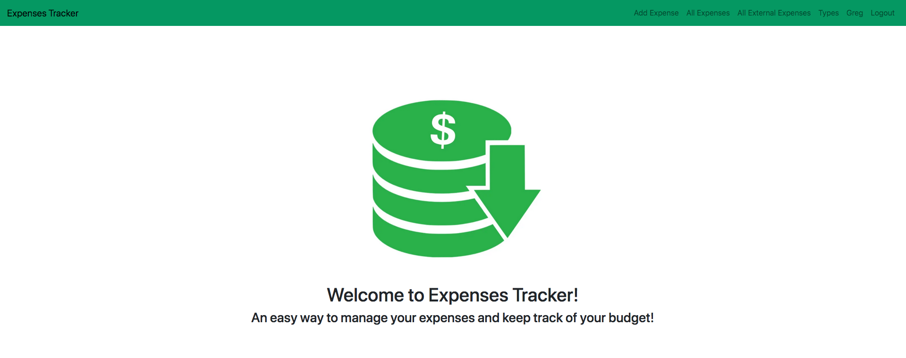

# ExpensesTracker

ExpensesTracker is an online web app that allows you to keep track of your expenses and budget. Users can create accounts and different types of expenses to keep track of.



## Built With

- Ruby v3.0.0
- Ruby on Rails v6.1.3
- Bootstrap

## Live Demo

[Heroku](https://peaceful-fortress-27562.herokuapp.com/)

### Deployment

` Heroku`

## Prerequisites

Ruby: 3.0.0

Rails: 6.1.3

Postgres: >=13.2

yarn

## Getting Started

To get a local copy up and running follow these simple example steps.

### Usage
- You need to have [Ruby On Rails](https://rubyonrails.org/) installed.
- Start by cloning or downloading this repo to your machine.
- Open the project folder in your terminal.
- Run `bundle install` to install needed gems.
- Run `rails db:migrate` to make sure the database is migrated.
- Run `rails s` to start the server.
- Go to `http://localhost:3000/` and sign up to begin testing.

### Run tests

```
    bundle exec rspec
```


## Authors

👤 **Greg Rabago**

- GitHub: [greg0109](https://github.com/greg0109)
- Twitter: [greg_0109](https://twitter.com/greg_0109)

## 🤝 Contributing

Contributions, issues and feature requests are welcome!

Feel free to check the [issues page](https://github.com/greg0109/expensestracker/issues).

## Show your support
Give a ⭐️ if you like this project!

